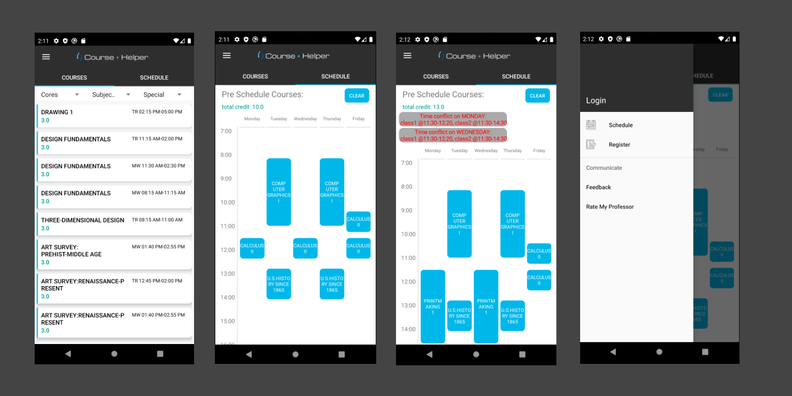

# Course Helper App

Created by tomoaki3284, [GitHub Page](https://github.com/tomoaki3284).
Source code [here](https://github.com/tomoaki3284/WSUCourseHelperApp).
If you have problem importing project on AndroidStudio, clone [this](https://github.com/tomoaki3284/WSUCourseHelperApp) repository.

## Who is this project for?
This project is for students at my university selecting the courses for future semesters with less work by utilizing various features, such as schedule visualization, filter course by various categories, etc.

## What is this project for?
The **problem** with the current process of selecting the courses through university website is that the **amount of work and time that students need to take to find the courses that fit the student’s major/needs is intense.** This project’s objective is to reduce the process of selecting the courses for future semesters by offering a variety of features to the user.

## What kind of features does this app have?
- [x] Filter courses by GE type.
- [x] Schedule courses by getting input from the user, and visualization
- [x] Time overlapped detector from the premade schedule by the user.
- [x] Credit calculation, or some simple calculation system that can be helpful to students.
- [x] Save data when the app is closed (using the internal file in android).

Not Implemented
- [ ] Feedback fetures
- [ ] Search courses by name, title, time range, etc.
- [ ] Faculty rating system.
- [ ] Login using database

## Inspiration
Many first-year students are having a hard time searching for classes through the current website that the university offered. I was the one too, who didn’t know what to do, or where to go for searching classes. I don't want anybody to get through this pain again just for searching up courses. 
