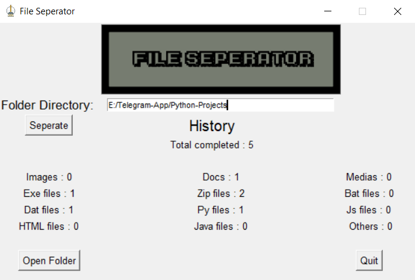

# File Seperator App

The project was created by Shahibur. GitHub link: https://github.com/Shahibur66 source code: https://github.com/Shahibur66/File-Separator-App

The project is basically a desktop app for file management in particular directory which is, separating various extension files from source folder to specific folder based on the file extensions using Python.



## Dependencies:
  * import os
  * import shutil
  * import tkinter
  * from tkinter.filedialog import askdirectory

### Usages:
  * ```$ python window.py``` or run START.bat  
  * To run window.exe, put window.exe in the `File-Separator-App` folder.
  * Open specific folder then click the `Seperate button`
 
