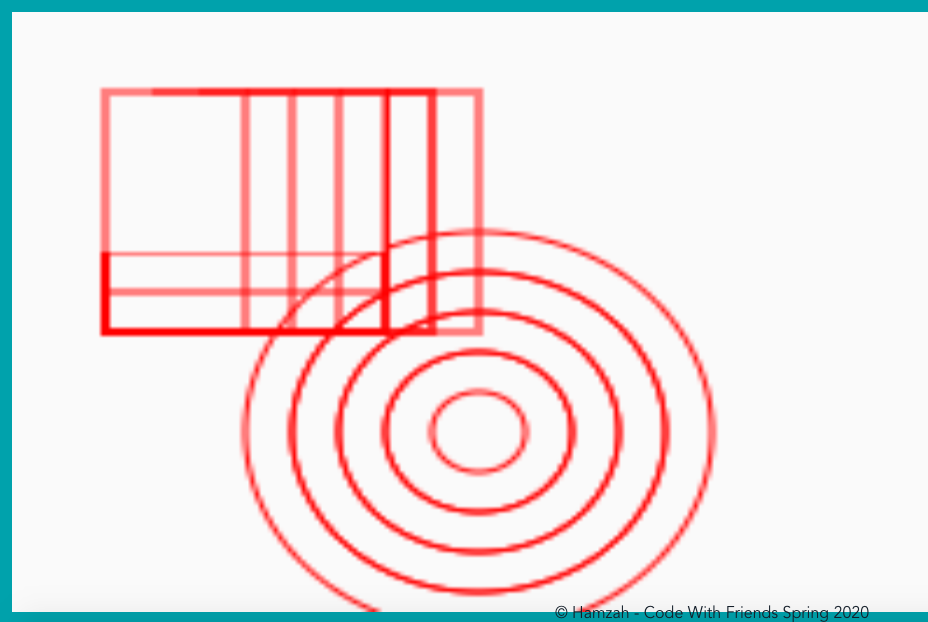

Code With Friends - Spring 2020

by Hamzah Fayad

I created a little drawing & todo WebApp
- You can add rectangles/circles on a canvas
- You can add and delete a todo

Tools: Vue.js, MongoDB

* About Page
Horizon Painting WebApp

* List Page
Create a list of things you'd like to paint

* Painting Page

