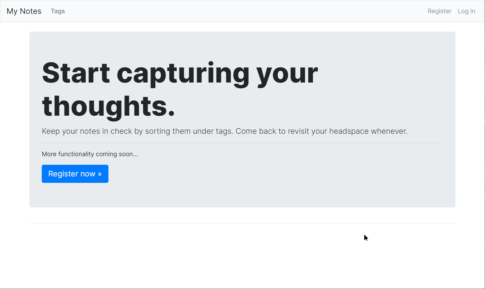

# Notes App for Routine Dashboard

Created by Allen Sun, https://github.com/allen-3/

(I'm `varepsilon` on Twitch, `mistersun` on Discord)

Source code will be here (this repository will be empty for a day or two as I get things set up):   https://github.com/allen-3/virtual-routine

Technologies used: `Django`, `Bootstrap`.

## Summary

For Code With Friends Spring 2020, I started work on a web app that aims to help people stay motivated and productive during quarantine. So far, I've completed just one small part of what I hope can become a fully-fledged site. For, now the name of the web app is "Routine Dashboard".

The idea is to give users an environment where they can warm up/wind down for their work-from-home day. Currently, the site contains a note-taking app where a user can jot down their thoughts and perhaps plan out their work day. The plan is to include other features, such as a timer and external links to a user's favourite podcast or Spotify playlist that they can enjoy while they get ready for their day.

As of writing this, I haven't deployed the web app yet; this is something I'll work on over the next few days (check the Github repo link at the top). For now, here's a GIF of the current (fairly minimal) site in action:

## Inspiration

Near the beginning of the current lockdown, I'd read a couple articles of people who were--curiously--starting to miss their daily commutes to and from work. Though I couldn't personally relate, I saw where these people were coming from.

In a way, our daily commutes ground us and give us some time each day to mentally prepare for / wind down from the work day. Lots of us enjoy a podcast or a music playlist while commuting, and no matter what it seems that everyone's daily routines have been affected in some way.

With this in mind, I figured I'd try to create a site that lets people have a sense of normalcy by allowing them to maintain some part of their pre-lockdown daily routines.

## Challenges

Time management was a huge challenge. During this month, I had to juggle a summer course and part-time work along with this project. It was a tough thing to do but I found it very rewarding in the end.

## Reflections

I'm fairly new to programming and this was my first web application, so I'm pretty satisfied with the amount I was able to get done this month. I followed a tutorial from the book 'Python Crash Course' by Eric Matthes for most of this project so far, adding in my own adjustments where I saw fit. I want to further build off of what I've created so far and make it my own.

I've learned that the ability to set achievable goals is huge. I initially put too much on my plate as I had so many ideas for features. As time went on I slowly began to realize that at my current ability and in the available timeframe, aiming for a small goal was really the way to go. That's why I ended up settling on making the notes function for now, and saving the rest for the upcoming months.

I had a great time working on this project and coding along with you all! This is definitely a project I'll continue to work on over the next few months and I'm really excited to share what I come up with.