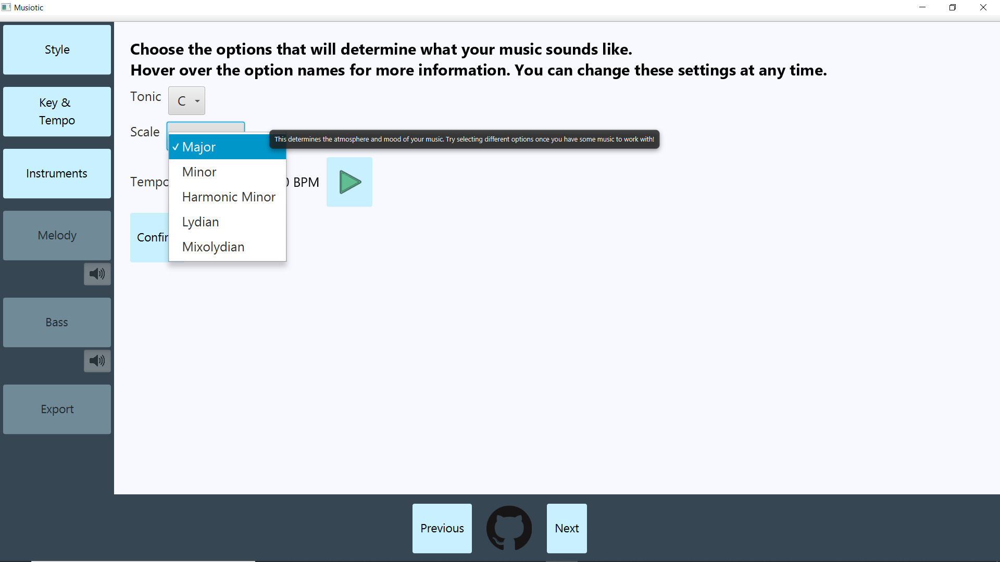

# Musiotic

Musiotic is a Digital Audio Workstation (DAW) allowing new music producers to get started with making music!
Our goal was to allow for people with little to no musical experience to be able to understand how to use
the application and start putting together notes and rhythms. 

Each song is created in phases, starting with a style selection. For the Code With Friends project we only
worked on implementing a Piano style, but we are planning on implementing more styles soon!

After creating a song, the user can export their work to a MIDI file which can be listened to on
Windows Media Player or similar. Screenshots and a demo of the application is below!

Jar or executable file coming soon! The lib directory has the dependencies we used
to run the application. We use Openjdk14 (not included).

## Feature List

* Create a piece of music with various Piano sounds.
* Change the starting pitch of the piece at any time (even after music has already been written!)
* Change the key / mode of the music at any time between the following choices:
    * Major
    * Minor
    * Harmonic Minor
    * Lydian
    * Mixolydian
* Change the tempo (speed) of the music at any time
* Select between different instruments to use for the melody and bass sections
* Fully create music down to the sixteenth note using an intuitive interface such that beginners can create amazing music
* Listen to music as it's being created, starting at any point in the piece
* Add measures to create music of any length
* Export your song to a midi file, to be played for later

###Title Screen

###Key & Tempo Screen

###Melody Screen

###Demo
