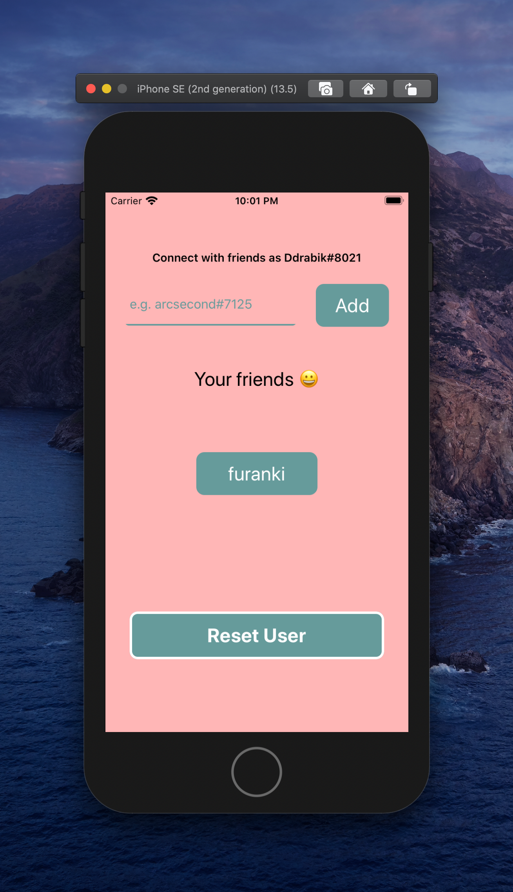

# A timer that makes you go AWWWWW

Created by:
David Drabik - https://github.com/ddrabik
Francis Tse - https://github.com/francistse23

Testflight link: https://testflight.apple.com/join/ioNIAPfK

## Summary

My friend and I built a Pomodoro timer that rewards you at the end!
When the timer goes to 0, you get a 🎁! It will probably be a cute cat or dog 😁

Share your 🎁 with friends. When you get some in return, that's more 🎁!

<table width="100%">
	<tr>
	  	<th width="33%"></th>
        <th width="33%"></th>
        <th width="33%"></th>
	</tr>
</table>

## Inspiration

> I wanted to try out React Native

-David

## Challenges

One of the biggest challenges was displaying images and video to the user. Reddit does not have a standard format for it's JSON API! Nearly every time we worked on the app, there was another edge case we had to handle.
