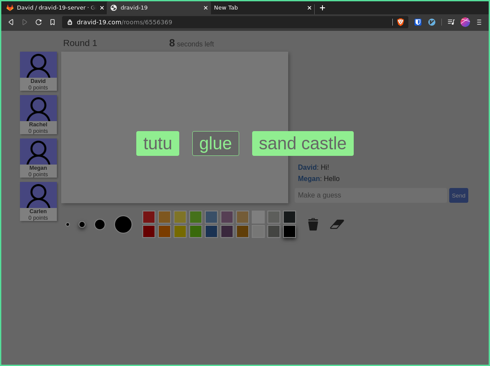

# DRAVID-19, web Pictionary with friends

https://dravid-19.com

Created by David Findley
https://gitlab.com/findley
https://github.com/tortis

Client source code: https://gitlab.com/findley/dravid-19-client

Server source code: https://gitlab.com/findley/dravid-19-server

## Summary

During CWF Spring 2020, I decided to make an online pictionary like .io style game.

| <!-- -->                  | <!-- -->                  |
|---------------------------|---------------------------|
|  |  |
|  |  |

## Inspiration

Since we started WFH at my job my team and I have gotten into the habit of playing skribbl.io and it has been a blast. I got interested in thinking about how I could build a game like this and decided to give it a shot.

## Challenges

The biggest challenge for me with this project has been learning Elm. I've done a little bit of functional programming here and there, but I've never really been able to feel very comfortable with it even though I like a lot of the principles. This is the largest project I've managed to build in Elm so far it was a bit of a struggle and the code is not as organized as I would like.

I also haven't touched docker/k8s in a little while. It took some trial and error to get everything building and deploying properly.

## Reflections

I'm really proud of what I have been able to build in about a week, but I have a lot of ideas for future improvements. I'm hoping to put some more polish on it and have my co-workers help beta-test it with me.

This app isn't novel (it's really just a clone), but I think it will be a first-rate implementaion of online pictionary with a little more polish.

One nice thing about a project like this is that I'm able to "cowboy" code to get a product working without having to worry so much about the best architecure, code style, etc. etc. like I would at work. I find it pretty difficult to get back into this mindset of "just make it work" instead of all the design/archiecture hand-wringing.
