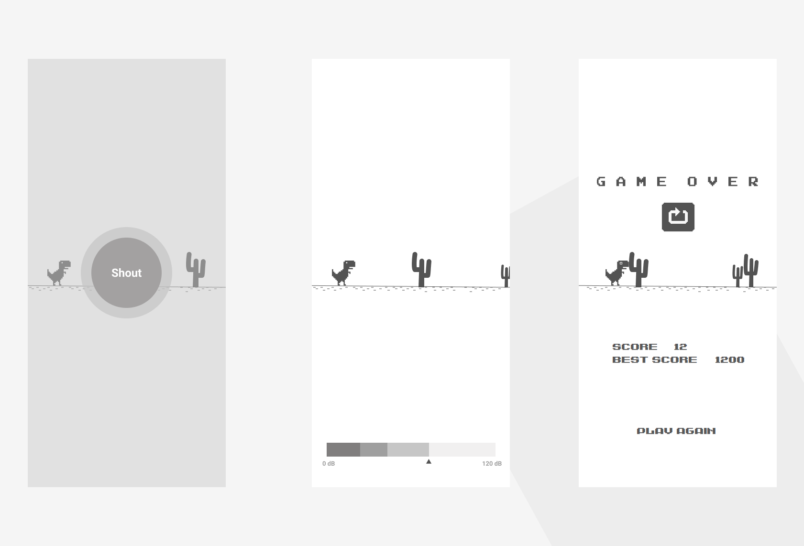

#### **`Code With Friends 2020` project ideation**:
***
#### Objective:

I want to make a mobile application that will be simple and can reduce people's monotony in the lockdown period.

#### Idea:

I am planning to make a voice controlled T-Rex app. As we know *T-Rex* 🦖 is the popular game that we can play when out internet goes off.

#### how will it work:
- There will be theree screens of the app
  - **Landing Screen**: First screen, user will be prompted to shout 🗣
  - **Main Game Screen**: T-Rex will jump based on user's voice impulse
  - **Score Page**: When user will fail, he/she will be redirected to score page where bast score & current score will be shown. Maximum score will be saved in local storage.
 - Jump of T-rex will be determined by the amplitude (in dB) of the input audio.
 - It will be a never ending game where obstacles will come with acclerated speed.
 
#### Technology to be used:

I am planning to make the application in `Flutter` framework and `Flame` game engine.

#### Summary
> I was thinking of different projects but unable to come up with something very new or original. First that came to my mind was voice controlled `Flappy Bird` as previously I was working on similar projects where we can control the bird with the help of an ultrasonic sensor and literrally flapping our hands over the sensor to keep the bird flying. But later come to know similar voice controlled `Flappy Bird` is already done. I felt sad, then thought about `T-Rex` and needdless to say someone also did this but I did not found any game on play-store. So I decided to make this one since the main object is to be `me++` after `may` not to stress on making something new.

#### Mockups:

