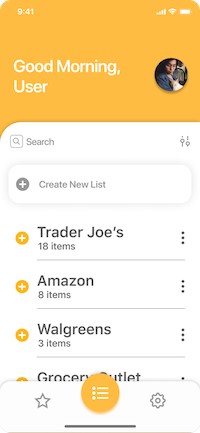
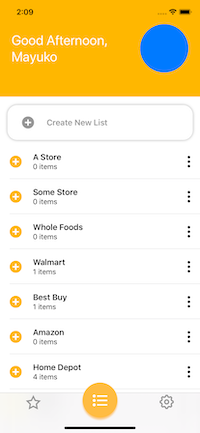
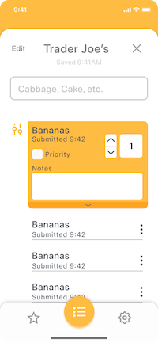
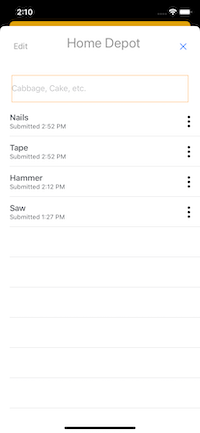

# MukosList, An iOS Shopping List App with SwiftUI

Created by Mayuko Inoue
https://github.com/hellomayuko
https://youtube.com/hellomayuko

Source code: https://github.com/hellomayuko/MukosList

## Summary

During CWF Spring 2020, I decided to make a Shopping List app. I wasn't particularly fond of the existing options on the App Store (either they had ads, or were too feature-heavy), so I decided to make my own! I had my brother Ray (www.linkedin.com/in/rayinoue) mock up some designs for me, and decided to write the app using SwiftUI (Apple's new UI framework) in the spirit of learning something new.

| Expectations (Designs)                         | Reality (Screenshots)                 |
| ---------------------------------------------- | ------------------------------------- |
|  |  |
|  |  |

## Inspiration

There weren't any existing Shopping List apps I was fond of. I don't need recipes, and I also want to be able to input custom foods (aka foods that most apps wouldn't know, aka ethnic foods).

## Challenges

The biggest challenge for me was to wrap my head around declarative-style UI progrmaming. After years of writing UI using UIKit (and in Objective-C, to boot), I figured I try using something very different like SwiftUI. Scott had told me that a lot of web frameworks write UI in the same way, so this was a great introduction to that method of thinking, but I definitely ran into some large roadblocks because of the huge paradigm shift. Not to mention all the Swift issues I ran into, since I'm pretty rusty on Swift and haven't really written a meaningful amount in over a year.

Logistically speaking, the co-coding streams helped me to stay motivated and be held accountable so that I work on my project at lesat 6 hours a week, so for once, time management wasn't an issue.

## Reflections

During this time, I feel like I re-learned Swift - it's evolved a lot over the years, and has really started to feel like a langauge of its own (rather than something close to Objective-C). Also SwiftUI! It wasn't quite as easy to make UI as was marketed because I think it required a lot more Swift-y knowledge than most beginners might have. It was quick to make UI's, but I think it took longer for me because I was trying to shake off the UIKit way of creating UI and basically reforming my brain to use this new paradigm. It might've been easier if someone came in with fresh eyes, but it was definitely a little bit more diffficult than I thought.

Not to mention, I found some limitations of SwiftUI itself, in that not everything supported in UIKit is supported yet in SwiftUI (which requires a SwiftUI wrapper of UIKit, which I avoided heavily).

I'm not sure what I would do differently - I maybe would've spent a bit more time on it than I did, but conversely working on this project gave me a sense of how much time it actually takes to learn something and implement brand new things.

Paul Hudsons' Hacking With Swift's SwiftUI guide wins the MVP award for my project - his tutorials were extremely helpful and was the most comprehensive SwiftUI guide I came across.

I would like to keep working on this project, and hopefully ship it to the App Store! I'm gonna set a goal to get this done before the end of the year. Should give me enough time.
