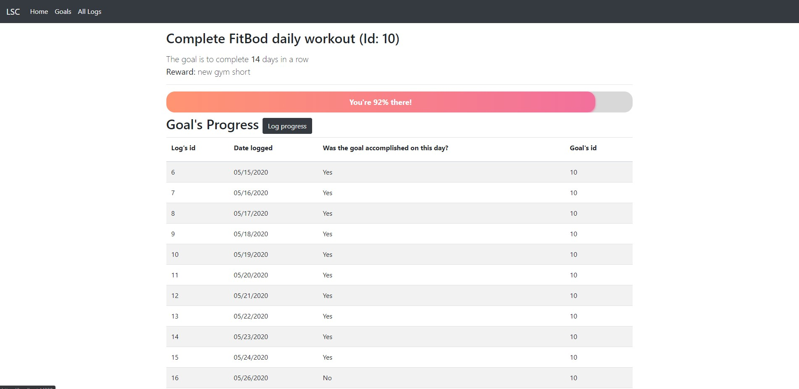

# Code With Friends Spring 2020 Submission
Author: Henry Nguyen, https://github.com/hnguye24

Source Code: https://github.com/hnguye24/lets-stay-consistent

## Thank you Mayuko and Scott
This event was the catalyst I needed to start working on personal projects. It's been a year since I started to learn to how code, and now I finally felt confident to make something on my own. It was encouraging to see people with various coding experiences come together to share their work and cheer each other on. What a wholesome coding community <3. Thank you for taking the time creating this event and supporting it throughout the month. This was a fantastic idea and I can't wait to participate in the next one!

## My Project: "Lets Stay Consistent!"
I always had a hard time exercising consistently. I wanted to create a simple web tool that will let me input my goals, log my progress, and keep track of my consistency. This application is far from complete, but I'm happy with the progress I have made so far!

#### Technologies used
* ASP .NET MVC (.NET Framework)
* Entity Framework
* Bootstrap

#### Screenshots

[More images in Screenshots folder](Screenshots)

## What I have learned:
* You never have as much time as you think
    * Despite signing up for the event before May and being excited to work on the project, I had a slow start and ended up spending most of May focusing on big life events (bought my first car)
    * I came in with a simple concept, but I ended up having to simplify it even further and being okay with the current state of the application
* Break tasks into smaller tasks
    * I found it helpful to break the application into tiny features (i.e. add ability to create goal, add ability to modify goal, and add ability to delete goal were three separate features)
    * On days where I had 0.5-1 hour of time to work on this project, I was able to look at my to-do list and pick one of the feature to complete
    * This was extremely satisfying, so I will continue to divide my future projects into tiny features that can be completed between 0.5-1 hour
* Git
    * For this project, I dipped my toe into doing simple actions using the command line (i.e. committing, reseting to last commit, pushing/pulling)
* GitHub
    * I've been using GitLab for my work projects, but this event gave me an opportunity to revisit GitHub. I'll definitely continue my personal projects on GitHub
* CSS and vanilla JS
    * I learned how to make my own calendar date-picker
    * I learned how to animate a custom progress bar
* [Entity Framework](https://docs.microsoft.com/en-us/aspnet/entity-framework)
    * This framework allows me to query data from my database without SQL query strings in my code
    * I was really intimidated by this framework, but working on this project has shown me how simple it is to use
