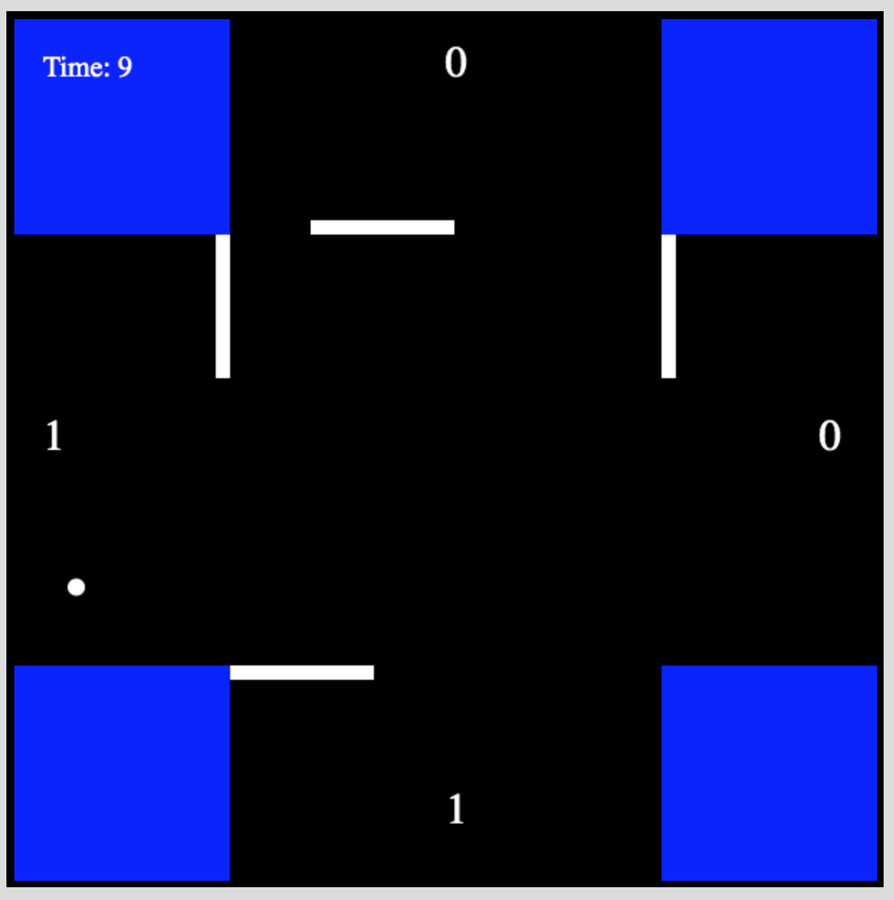

   

# Four Player Pong
An online remote version of the classic arcade game Pong — but with four players. Built with Node.js, Express, React, and SocketIO. 

Play the game here: https://four-player-pong.herokuapp.com/

## Summary
Four people verse amongst each other on who gets the highest score in Pong.

## Inspiration
Based off a minigame from Pokemon Stadium 2!

## Challenges
As the state of the game (e.g. where the ball is, did the ball pass the goal?) is constantly changing, SocketIO involves heavy interaction with both client and server. As a result, from this project, I learned a lot about safely moving functionalities to new classes and hiding implementation details between the client and server.
