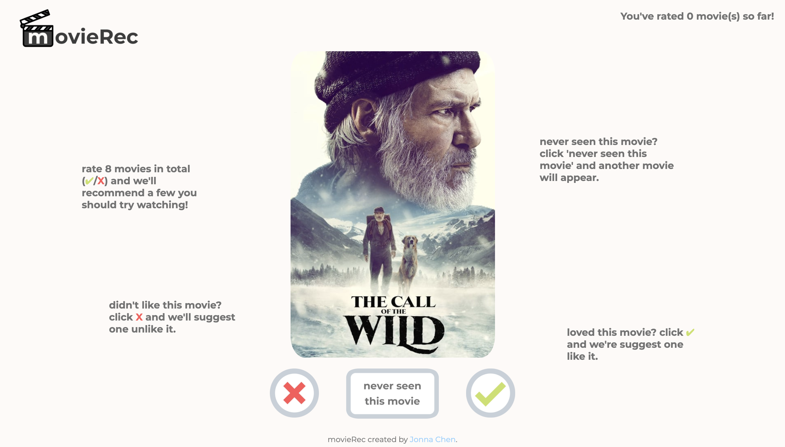

## Summary 
[movieRec](https://movierec-cwf.herokuapp.com/) is a recommendation web application created from scratch for Code With Friends 2020 event. It uses a 'tinder'-based approach to gather ratings for movies, and displays a movie based on a basic recommendation algorithm. This concise rating-and-recommending approach allows for a quick solution to the age-old question: "What movie should I watch tonight?"

### Find the finished product [here](https://movierec-cwf.herokuapp.com/).

## Visuals
Initial designs for the website were created using [Canva](https://www.canva.com/) and can be found [here](https://www.canva.com/design/DAD77phtTd4/2dzfjYMpn9fSuayCMv4Rbg/view?utm_content=DAD77phtTd4&utm_campaign=designshare&utm_medium=link&utm_source=sharebutton).

### Home

### Results

## Technologies Used
**Languages:** Python, HTML/CSS, JavaScript 
**Other:** Flask, Heroku, GitHub

## About *Code With Friends 2020*
Code With Friends is a month-long event in May where people world-wide come together to work on coding projects of their own, all with an online community. The prompt for this event was *Quarantine Improvement*. 

## Acknowledgement
This product uses the [TMDb API](https://developers.themoviedb.org/3), The Movie Database, but is not endorsed or certified by TMDb. Icons found in the logo and favicon were sourced from [OpenMoji](https://openmoji.org/), a website for open-source emojis.
