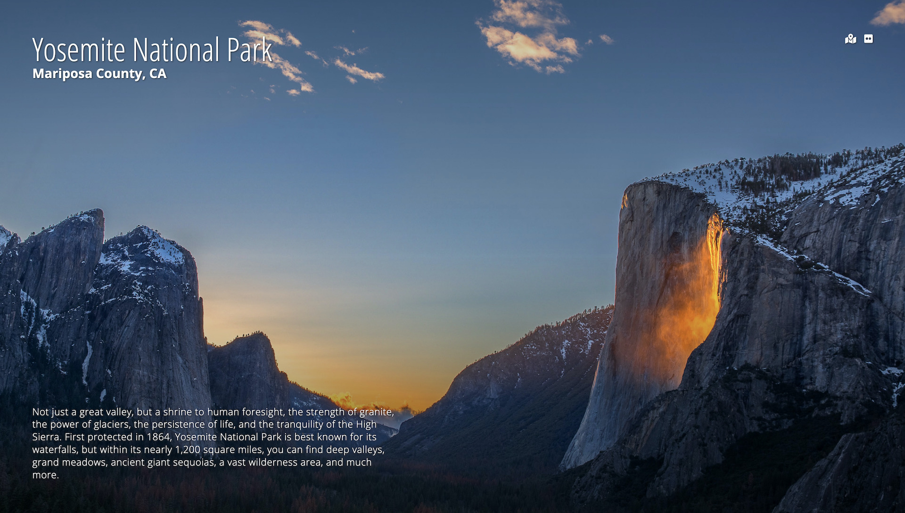

[](https://app.netlify.com/sites/outdoor-inspiration/deploys)


 

###### Please consider supporting my work and other projects:

[](https://offset.earth/luisaugusto)
[](https://www.buymeacoffee.com/luiscodes)

# ⛰ Outdoor Inspiration

A new tab extension that displays photos and descriptions of US National Parks.

| Chrome | Firefox |
| --- | --- |
| [Download](https://chrome.google.com/webstore/detail/mjgkcdcikkpendiikknkdhanooeiohee/) | [Download](https://addons.mozilla.org/en-US/firefox/addon/outdoor-inspiration/) |

> The app can also be previewed as a static site [here](https://outdoor-inspiration.netlify.app/) as well as run locally.



Photos from the application are fetched from my galleries in [Flickr](https://www.flickr.com/photos/188326816@N04/galleries), and information about the park is pulled from the [NPS website](https://www.nps.gov/index.htm).

## About the Project

### Inspiration

I build this project as part of the [Code with Friends](https://scottkwang.github.io/CodeWithFriends-Spring2020/) event in May 2020, which had a theme of building something to improve quarantine life.

I love being in the outdoors, and having to comply with shelter in place can make it difficult to experience nature while also being cooped up all day and working from home. Outdoor Inspiration was built as a reminder of what is waiting for us when life returns to normal, and to encourage people to make plans to explore the outdoors. I wanted to inspire people with views of natural wonders while they are unable to experience them in person.

### Challenges and Reflections

I used this project as a learning experience for building extensions on Chrome and Firefox. While the initial build is a very simple extension that basically replaces the new tab with a Vue application, I plan to add to this over time and build more features to better integrate it with each browser.

I primarily used the [Chrome Extension Guide](https://developer.chrome.com/extensions) to build this out initially. For Firefox, I used their [Extension Workshop Site](https://extensionworkshop.com/) to learn about their process, but since I have a very basic extension, I just had to make sure my `manifest.json` file was compatible with Firefox. Mozilla has a very useful tool called [Extension Test](https://www.extensiontest.com/) which I used to test my Chrome extension, and fortunately it was easily portable over to Firefox.

## Developer Notes

### Installation

Clone the repository to your computer and install dependencies.

```
$ git clone git@github.com:luisaugusto/outdoor-inspiration.git
$ cd outdoor-inspiration

$ npm install
```

### Usage

Compiles and hot-reloads for development:

```
npm run serve
```

Lints and fixes files:

```
npm run lint
```

### Building the Extensions

You can use `npm run build` to build the Vue app, and after that you will need to zip the files in the `dist` directory. Don't just compress the `dist` directory, select all the files and compress those together. Compressing the `dist` directory directly may add a level of directories, and it might not be read correctly by the browsers.

For Firefox, you can upload a build locally by navigating to [about:debugging](about:debugging), and load a temporary add-on from there. You can find more instructions [here](https://extensionworkshop.com/documentation/develop/temporary-installation-in-firefox/).

For Chrome, you can load an extension by going to [chrome://extensions/](chrome://extensions/) with developer mode enabled. You can find more instructions [here](https://developer.chrome.com/extensions/getstarted).

## Contributing

Pull requests are welcome. For major changes, please open an issue first to discuss what you would like to change.

To make a contribution, you can follow these steps:

1. Fork the repository to your account and clone your forked copy.
2. Create a new branch and make any changes on that branch.
3. Create a pull request using that branch onto my master branch. If the changes are to resolve an issue, please reference the issue number in the pull request.
