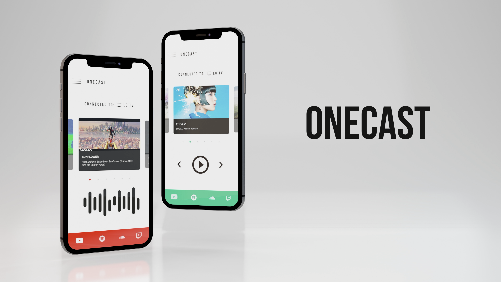

# OneCast - One click to stream them all.

OneCast is an app which allows you to cast your favorite playlists from Youtube, Spotify, SoundCloud and Twitch. All with just a click of a button.

Product Reveal Teaser: [Youtube Link](http://www.youtube.com/watch?feature=player_embedded&v=Rhxnk7mcDOs)

## Inspiration
The idea for the app came when Mayuko and Scott inspired me with the Theme "Quarantine Improvement". 

Once quaratine kicked-in, I started using various Online Music Streaming Services. The issue though was the constant switching between those apps in my TV. Using the TV Remote, the switch took multiple button presses and searching music was also a huge pain in the non-intuitive UI. So, I thought of integrating the services into one single app and cast my favorite songs and playlists with just a click of a button.

## Packages/Stack Used
    1. React Native.
    2. Material Bottom Navigation.
    3. Snap Carousel.
    4. NodeJS for Mobile.

## Modules Completed

Implementation and Test for the following modules have been completed:

    1. Play Youtube Videos to TV.
    2. Play Spotify Songs & Playlists to TV. (Using Spotify APIs)

## Product Reveal Teaser - Stack
    1.  CG Elements - Blender
    2.  Edit - Final Cut Pro X.

## Release Information and Schedule

Since React Native was used for development, the app would be made available on both iOS App Store and Android Play Store.

Release Target: Early Summer 2020.

