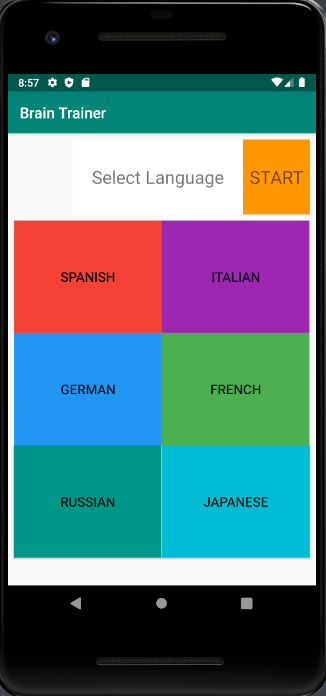
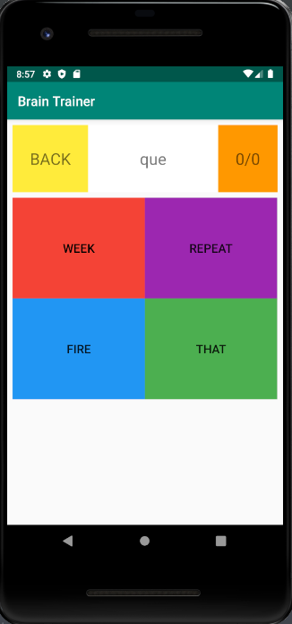
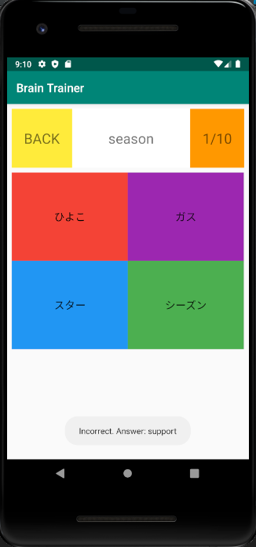
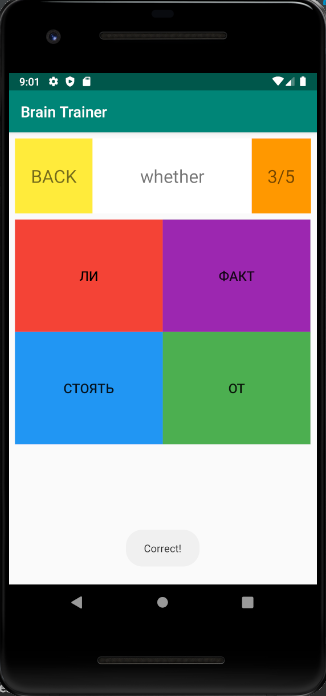

# Brain Trainer, An Android App for Practicing Vocabulary in Foreign Languages

Created by Roman Khzouz, 
https://github.com/rkhzouz

Source code: https://github.com/rkhzouz/BrainTrainer

## Summary

During Code With Friends Spring 2020, I wanted to make an Android app because I was learning Android development. I was watching an Android tutorial and the instructor was creating an app to practice math. I was inspired with the design and modified the idea to practice common words for foreign languages. I created the app with Android Studio and Java, and created a simple C++ script to help parse data from 1000mostcommonwords.com. Current languages in the app are Spanish, Italian, German, French, Russian, and Japanese.

## Inspiration

I wanted to study common words in many different languages. I also wanted to practice creating an Android app from scratch.

## Challenges

One of the challenges I encountered was finding a way to easily copy words into xml format. I created a C++ script that takes 1000 words from 1000mostcommonwords.com and outputs the words in xml format into two string-arrays. This allowed me to add functionality for multiple languages very quickly. 

## Reflections

I learned a lot about Android development and project design. There were multiple times where I was challenged with incorporating single features into the project. This is a very small project but I have more confidence in my ability to develop Android apps.

This project was fun to create. In the future, I would like to add more features to this app such as more languages, a timer mode, and keeping track of the user's high score.

The design is based off of The Complete Android Oreo Developer Course by Rob Percival, Nick Walter.
The words and their translations are from 1000mostcommonwords.com.

Thank you for Mayuko Inoue and Scott Kwang for organizing this event!