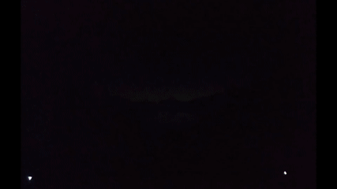

# Digital Window

Created by

- Tommy Deng ([sttic](https://github.com/sttic) on GitHub)
- Vivian Diec ([viviandiec](https://github.com/viviandiec) on GitHub)

Source code: https://github.com/sttic/CodeWithFriends-Spring2020

Digital Window is a submission for the [Code With Friends - Spring 2020](https://cwf.hellomayuko.com/) event by Mayuko Inoue and Scott Kwang.

## Summary

Digital Window aims to mimic a real window in situations where they are not available.
It does so by transitioning between different images of the day depending on the current time.

A key feature is that it adjusts your display's backlight brightness, as in brightening or dimming your screen.
This is better than just adding filters or doing any software adjustment to an image because this physically changes the amount of light being produced.
Changing the backlight makes showing a true fully black screen possible on a common LCD display (turning it off to 0% brightness late at night) while still allowing it to be turned back up to maximum brightness during the day.

<div class="container center">
    
    <div class="caption">
        <p><i>Screen capture of crossfading background from the project (video is sped up).<br/>Backlight dimming can't be seen with this.</i></p>
    </div>
</div>
<div class="container center">
    
    <div class="caption">
        <p><i>Actual appearance of screen, with backlight dimming, recorded on a phone (video is sped up even more).
            <br/>Dimming/brightening is reduced in the recording because of auto-exposure. Notice the screen getting dark and turning off and back on.
        </i></p>
    </div>
</div>

Original art is [Lakeside by Louis Coyle](https://dynamicwallpaper.club/wallpaper/jculsb683ok).

This is a web app meant to be ran locally on your machine.
It's recommended to set your browser to fullscreen while this is active.
It is built with [Next.js](https://nextjs.org/) and [Node.js](https://nodejs.org/).
The project requires the [xbacklight command](https://linux.die.net/man/1/xbacklight) and was tested on Manjaro Linux.

## Inspiration

I realized how much I need a window for me to keep my circadian rhythm in check after having moved in to a new basement room recently.
The pandemic situation only makes it worse.
It helps that I do my best to go outside for long walks, runs, and penny boarding as often as I can, but it's not enough and sometimes it's not even possible.

## Challenges

There wasn't much time to work on the project due to full-time internship work and extracurricular/volunteering activities.
While very fortunate to have those, it greatly cuts down on the amount of free time available.
There were plans for more features like live streaming outdoor footage, bird sounds, better UI/UX, etc., but there wasn't enough time.
Sounds like continuing the project is in order!

## Reflections

Planning and proper time allocation to develop features would be nice.
Far too many features were considered and hoped for given the amount of free time.


# Project Setup

This is a [Next.js](https://nextjs.org/) project bootstrapped with [`create-next-app`](https://github.com/zeit/next.js/tree/canary/packages/create-next-app).

## Getting Started

First, run the development server:

```bash
npm run dev
# or
yarn dev
```

Open [http://localhost:3000](http://localhost:3000) with your browser to see the result.

You can start editing the page by modifying `src/pages/index.js`. The page auto-updates as you edit the file.

## Learn More

To learn more about Next.js, take a look at the following resources:

- [Next.js Documentation](https://nextjs.org/docs) - learn about Next.js features and API.
- [Learn Next.js](https://nextjs.org/learn) - an interactive Next.js tutorial.

You can check out [the Next.js GitHub repository](https://github.com/zeit/next.js/) - your feedback and contributions are welcome!
