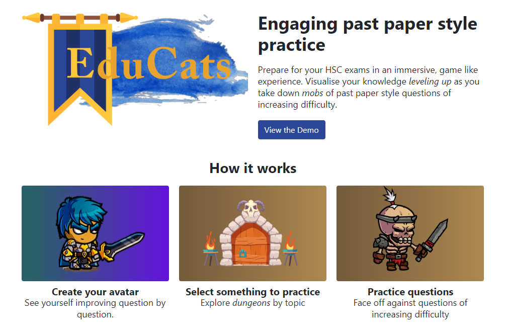

EduCats: A project by William Kuang, https://www.educats.com.au/

Ambitious personal project, so no source code but you can find my LinkedIn and Twitter (where I tweet as part of #100DaysOfCode) below.

LinkedIn: https://www.linkedin.com/in/william-kuang-151a2a58/

Twitter: https://twitter.com/uuykay_1337

## Summary

In the month of May, I was inspired to learn in public with Code With Friends (along with 100DaysOfCode) to work on my startup product EduCats.

Educats aims to solve Australia's declining engagement and performance in STEM subjects by empowering students to practice for their exams with a gameful mindset.

The goal of my project was to create a 3 question demo, featuring the core mechanics that would create a feedback loop for learning. There would be a basic avatar system, along with a way to spend accumulated currency at the end. Upon finishing the demo, I would interview 5 current students and gather insights. The domain is high school, year 12 physics for Australian students studying for the HSC.

## Inspiration
Australia faces a STEM literacy crisis, with enrolments in STEM subjects at their lowest levels in 20 years, and performance declining relative to other countries and in absolute terms.

Inspired by the potential that games have to motivate us, challenge us, and empower us, I set out on a mission to fuse the benefits of games with education to engage and educate high school students studying for their exams.

## Challenges
The project involved a number of challenges. Firstly from a design perspective, I wanted the concept to feel natural and not ham fisted. I also had to keep the prototype scoped to be able to deliver.

The avatar system was an interesting challenge. For simplicity, everything was done with position absolute, and Z indexes, and React's component based system along with SCSS modules made it super easy to swap assets out. The downside being responsiveness, which will probably need to be addressed with canvas over html images.

The project also gave me an excuse to try out React's new Hook API which just feels like a breath of fresh air.

I chose to use GatsbyJS because it provides routing, static html pre-render, and code splitting out of the box. EggheadIO makes a great case for it to be a replacement for Create React App. So far I've been happy with the choice.

Maintaining state between page routes has been a technical challenge that I have solved temporarily with sessionStorage. I am in the middle of investigating incorporating Redux with the project.

Hosting/deployment was another challenge. I used AWS's Amplify console to deploy, and it has mostly been a breeze. The only challenging part was I created an accidental instance in a different region and I couldn't link my custom domain for a week until I discovered the error.

## Reflections

I learnt that planning is a great way to keep projects on track and scoped. I learnt that accessibility is super important, and learning from customer interviews reveals flaws in your design.

I leart React's Hook API, and created my own system in Trello. I found learning in public to be a great way to keep me accountable. I learn more about what I want and what motivates me.

What I think I would have done differently would have been to focus less on abstractions. I created components that make use of render props that now in retrospect need to be refactored.

I made use of Typescript (learning) and hoping it pays off down the line (moderate confident it will) but there have been usage pains.

Resources I found helpful have honestly been the docs from different providers like GatsbyJS, Typescript, AWS Amplify along with podcasts for motivation.

