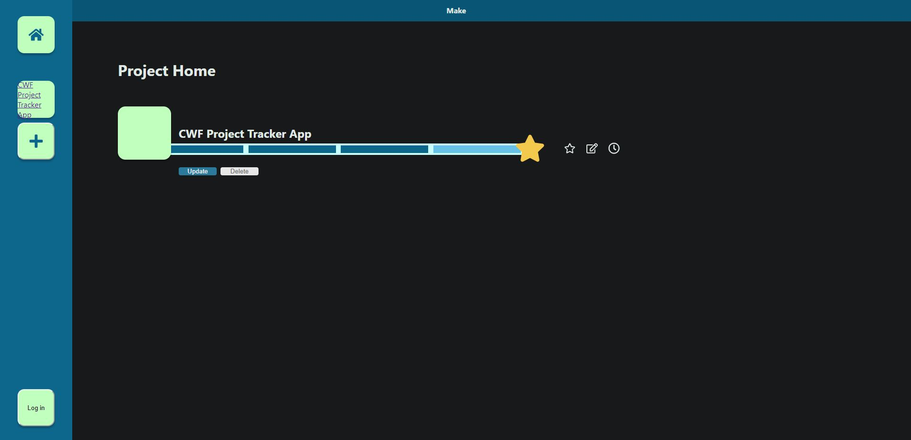
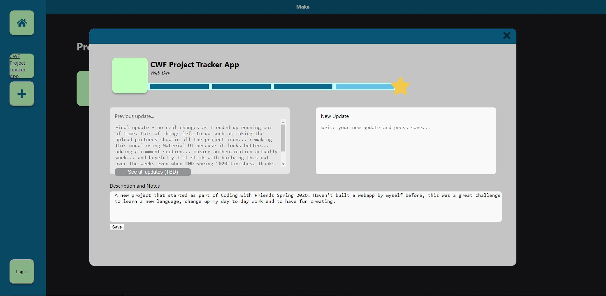
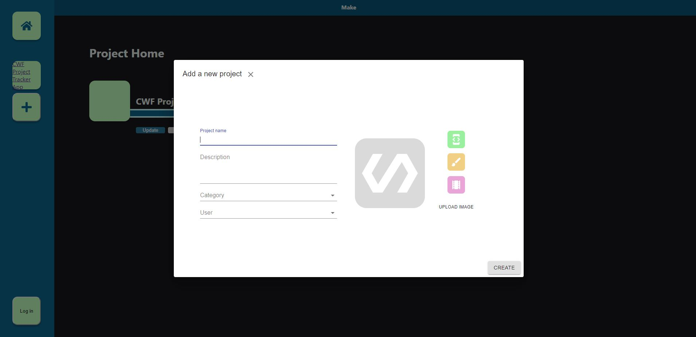
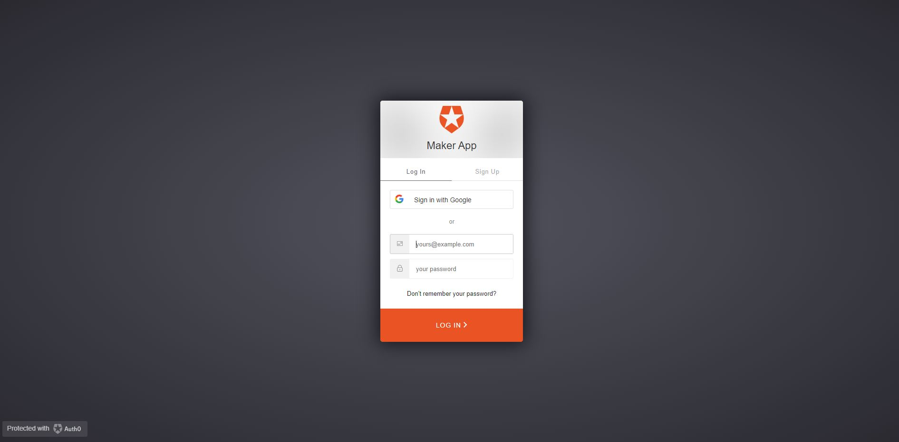

# Maker, a web app to track projects that you work on using React

Created by William Huynh
https://github.com/williamhuynh

Source code: https://github.com/williamhuynh/project-tracker
heroku deployment: https://limitless-escarpment-51341.herokuapp.com/

## Summary

As part of CWF Spring 2020, I decided to try my hand at coding and built an webapp using React. I've never really made anything before as my day to day is as a business consultant where Powerpoint is my weapon of choice. Having wanting to learn more about web and app development, I thought JS would be the most flexible language to learn. This idea came because I often have lots of different projects I do, but I keep putting them off or forgetting about them. And when I use trello and put all my tasks up, the volume of things to do often freak me out and I throw in the towel right then and there. The vision for this app is to make doing personal projects fun, not daunting and just focus people on making stuff.

|          Screenshots                   |
| -------------------------------------- |
|            |
|        |
|          |
|      |

## Inspiration

I often have lots of different projects I do, but I keep putting them off or forgetting about them. And when I use trello and put all my tasks up, the volume of things to do often freak me out and I throw in the towel right then and there. The vision for this app is to make doing personal projects fun, not daunting and just focus people on making stuff.

## Challenges

The biggest challenge for me was learning React, web development, and figuring out more or less everything from scratch. I've dabbled in HTML and CSS before so that was a little easier, but wrapping my head around state management, Material UI, firebase, etc was a first. One of the biggest challenges is that I just don't know whether a framework or a piece of code is "good", so alot of my time was spent in trialing different things and seeing what did what - making the code a little messy.

## Reflections

I learnt lots, and was glad that I did this. Trying to balance full time work with doing a side project is not always easy, but I think the weekly check-ins, the incremental progress and just focused on making something rather than planning made it work.

I'm going to continue building this out, but I already have other ideas I want to try! I really want this project to be up and running and I can use it to collaborate with my friends on other projects.