# PyArchive: Integrated file backup solution
Created by Bruce Xu:
* My GitHub Profile: https://github.com/xuganyu96
* Project source code: https://github.com/xuganyu96/PyArchive
* Watch video demo here: https://youtu.be/OxYqd7Sc_kI

## Introduction
PyArchive is an integrated file backup solution with a web GUI that provides a number of features 
that make it superior to conventional backup solutions:

## User side major features
| Feature screenshot| Explanation |
| :--- | :------- |
| 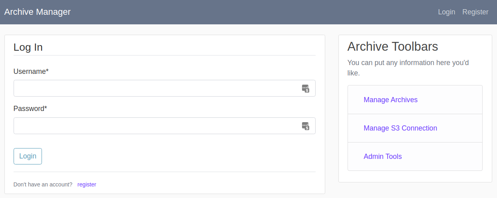 | Register and login just like with Google Doc; each user has access to only his/her own archives. This allows an entire family to use a single server. |
| 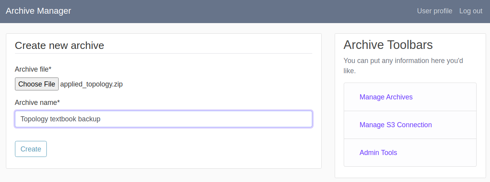 | Create an archive with a simple setup of choosing a file and giving it an archive name. Creating an archive initiates the process of transferring data from user's laptop to the local server using high speed local network |
| 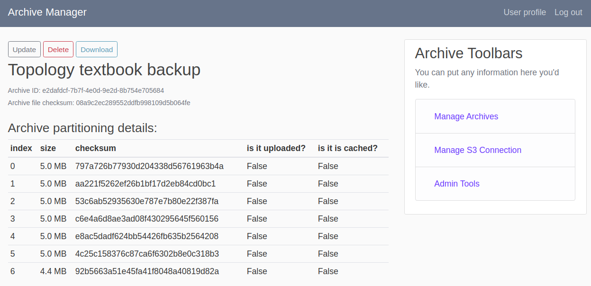 | The detail page of an archive explains how a complete file is chunked into smaller batches and gives each batch of data a unique index for easy identication |
| 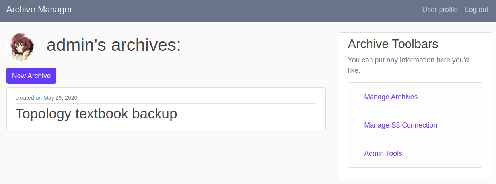 | Archive becomes visible in the user's home page after creating it locally |
| 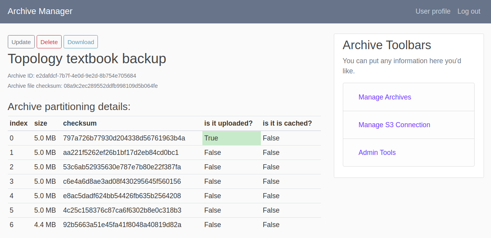 | Track the progress of archive upload through visual cues: if a file part has been remotely backed up to S3, `is it uploaded` becomes green |
| 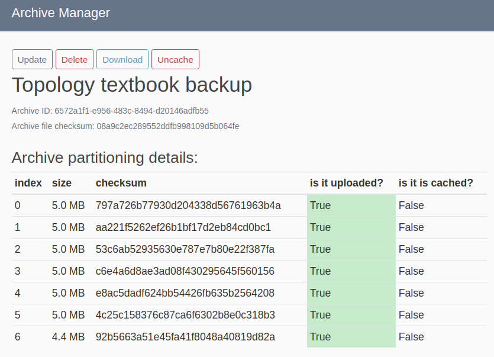 | Once an archive is completely backed up to remote, it can be "uncached" to make space to later archives |
| 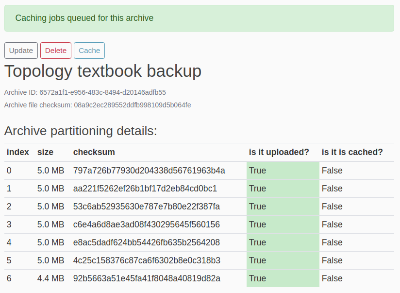 | An archive that is not locally avaialble can be requested to be cached from remote; the batch download process happens in the background |
| 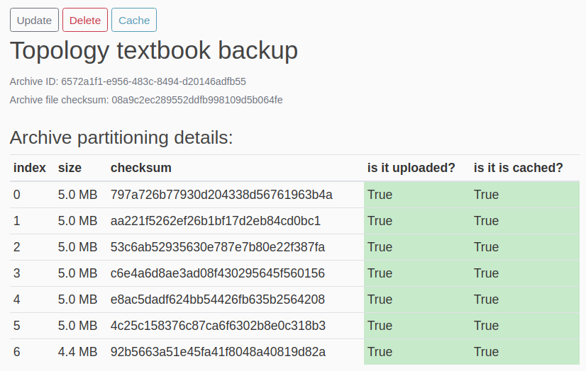 | After all archive's parts are in place, they will be assembled back into the original archive file for immediate access. After assembly, the download button will come back |
| 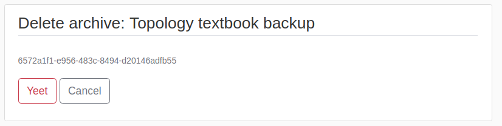 | Archive can be deleted permanently |

## Admin side major features
| Feature screenshot | Explanation |
|:---|:---|
| 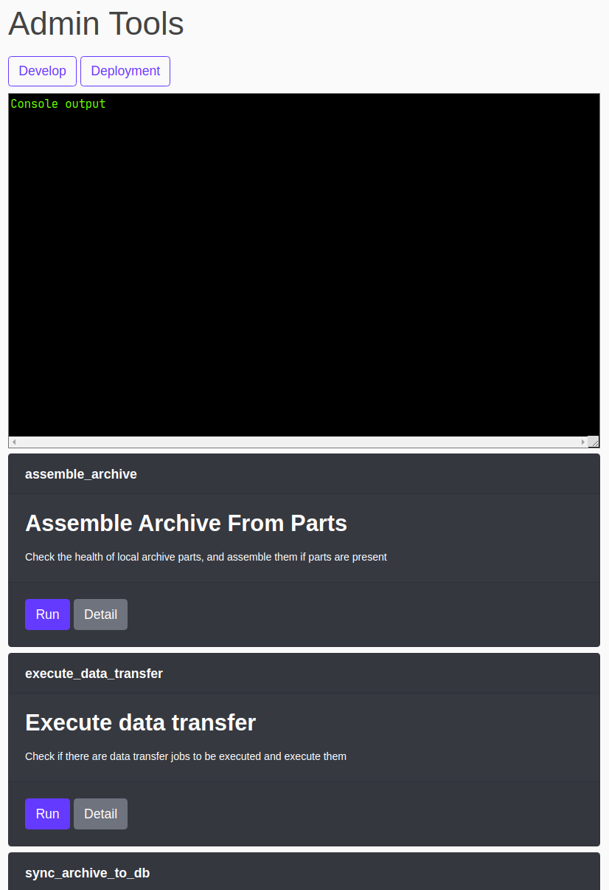| A system admin has can perform tasks in the form of python scripts. Each script is represented by a single card on the home page, and can be triggered or inspected with a single button click |
| 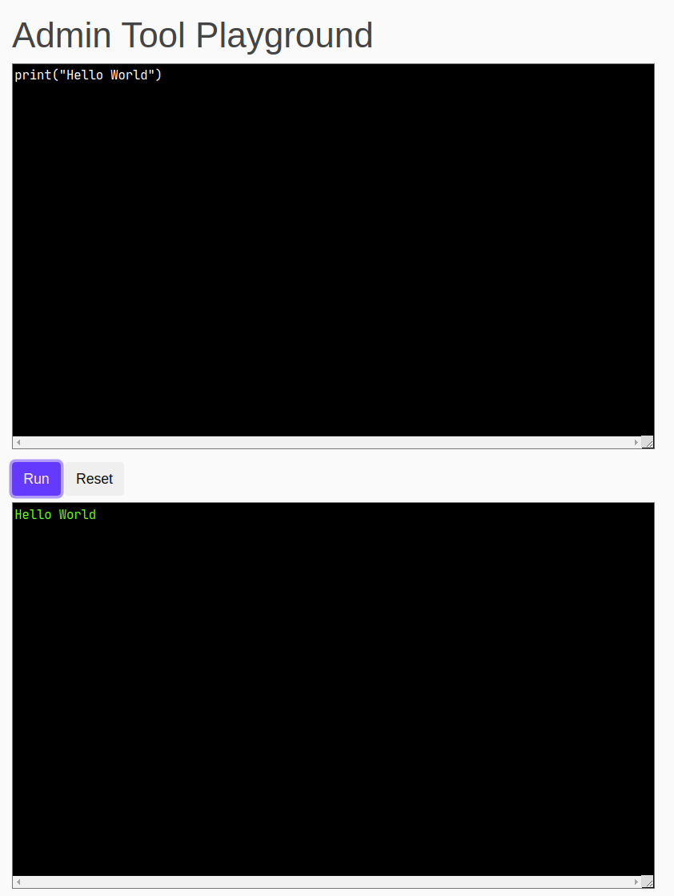 | System admin can write custom script in the "develop" page and test it on the spot (with access to all project models as if in `django manage.py shell`). The script can later on be saved and displayed on the home page. |
| 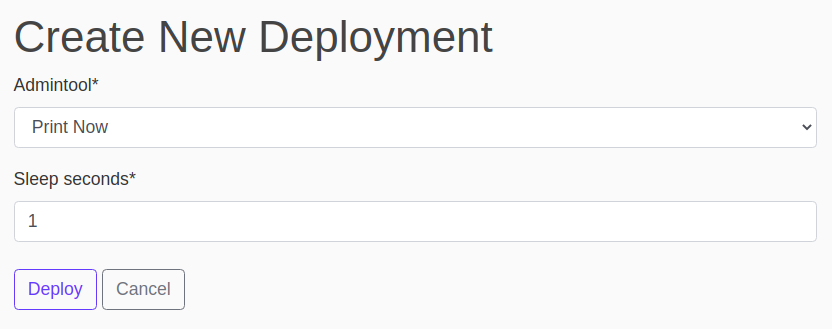 | System admin can create deployment scheme by specifying which script to run and the interval at which a script run is repeated |
| 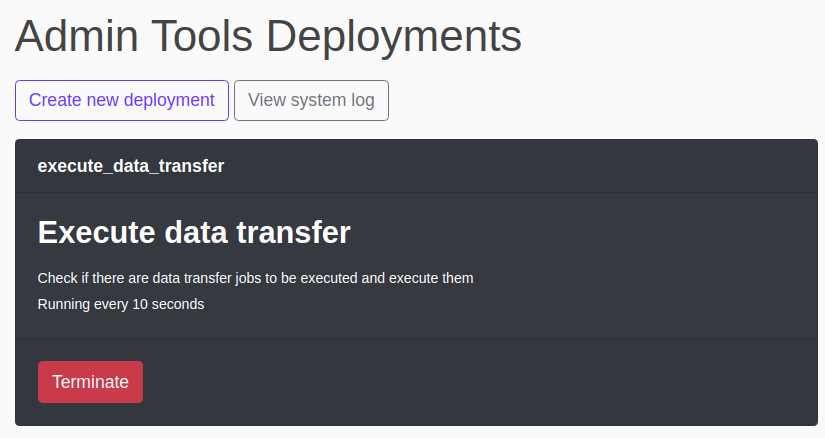 | Deployments in action can be viewed on the deployment home page, and can be terminated with simple button clicks |
| 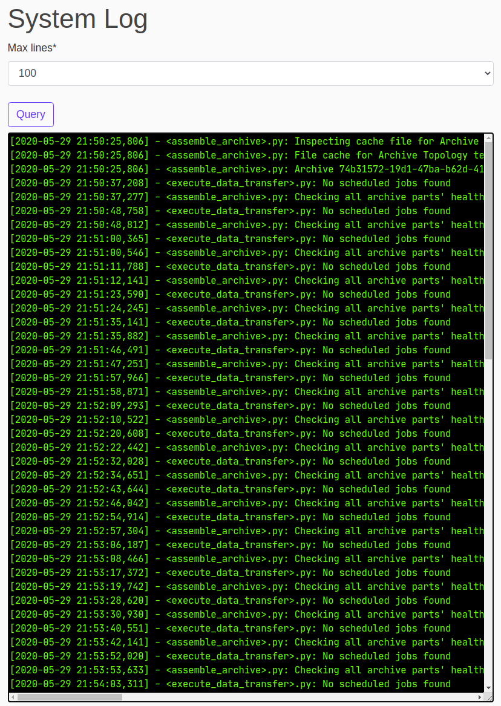 | System admin can monitor deployment status by querying from system log |

## Remote backup component 
  
* Batch uploads and batch downloads: robust against unexpected system outage
* Visual tracking of progress for uploads and downloads
* Data integrity ensured throguh file checksum
* Cache-uncache cycle for balancing speed and accessibility

## System admin utilities
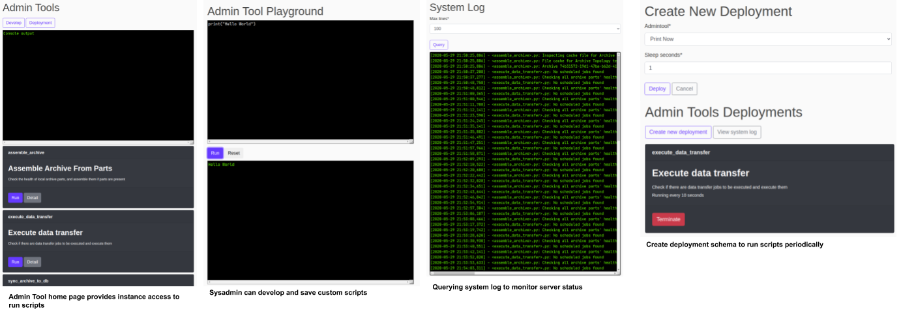  

## Inspiration 
On many occasions when I wanted to backup important data to Google Drive, I had to go through tedious 
long upload process because the file I wanted to upload is several gigabytes in size, but my home 
internet connection only has 600 kilobytes of bandwidth. The long upload time also introduces the 
possibility of being interrupted by an internet outage, or my laptop accidentally going to sleep, 
which could make me lose hours of upload progress. 

My frustration with online data backup solution inspired me to create this project, which combined 
local backup solution with remote backup solution and addressed a number of shortcomings from either 
category of data backup solutions. Local backups are fast and convenience, but is prone to catastrophic 
hardware failure and data loss, so I introduced a remote component that serves as a more robust 
secondary archival backup; remote backups are slow and prone to disruption, so I introduced a batch 
processing mechanism to limit progress loss in the event of a system outage. In addition, by deploying 
the entire project onto a Raspberry Pi, the entire remote backup process can be done on the background 
without user supervision, thus saving time and mental energy.

During the development process, I was also bothered by the amount of under-the-hood work that I had 
to do to debug and finetune system behavior. This inspired me to also develop an `AdminTool` module, 
which allowed the system admin to write, save, and deploy scripts entirely from the Web GUI, without 
needing to do any remote debugging through SSH.

## Challenges
* I have to learn Django entirely from scratch, and later on during the development process, I also 
have to learn to implement a websocket connection within the Django frameowrk, from scratch. It's
incredibly fortunate for me that there is a lot of resource online regarding the fundamentals of 
Django, and the tutorial for `channels` is also very helpful.
* I can work on the project for no more than an hour everyday, so I needed to track my progress and 
know where I left off for the previous work session. In the end I made a mock-up Kanban board on 
GitHub and was able to clearly articulate the various problems and features that I worked on as 
issues linked to pull requests.

## Reflection 
1. Learning new thing is fun! 
2. There is great value in streamlining a system admin's work, which I have learned through the 
development process of this project as much as I have learned from work (I work on data platform 
and development platform). A developer/system admin is capable of going under the hood and make 
scrappy fixes, but that doesn't mean that he/she could not make certain processes more streamlined. 